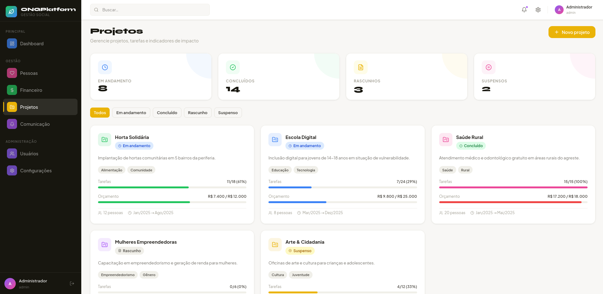

<div align="center">


# 🌱 ONG Platform

### Plataforma open source de gestão para organizações sem fins lucrativos

<p>Gerencie pessoas, finanças, projetos e comunicação em uma única plataforma — gratuita, modular e pronta para rodar com Docker.</p>

<br/>


<br/>


</div>

---

## 📸 Interface

<table>
  <tr>
    <td align="center">
      <br/>
      <sub><b>📊 Dashboard</b> — visão geral com indicadores e gráficos em tempo real</sub>
    </td>
  </tr>
  <tr>
    <td align="center">
      <br/>
      <sub><b>💚 Financeiro</b> — controle de receitas, despesas, doações e saldo</sub>
    </td>
  </tr>
  <tr>
    <td align="center">
      <br/>
      <sub><b>💛 Projetos</b> — gestão de projetos com progresso de tarefas e orçamento</sub>
    </td>
  </tr>
</table>

---

## ✨ Sobre o projeto

Muitas ONGs brasileiras ainda dependem de planilhas desconexas, cadernos físicos ou sistemas pagos para gerir suas operações. O **ONG Platform** nasceu para mudar isso.

Uma plataforma profissional, open source e gratuita que qualquer organização pode instalar com um único comando — seja num servidor próprio, numa VPS ou localmente com Docker.

---

## 🎨 Módulos

| Módulo | Cor | O que faz |
|---|---|---|
| 📊 **Dashboard** | Azul | Indicadores, fluxo financeiro, atividades e tarefas pendentes |
| 🩷 **Pessoas** | Rosa | Membros, voluntários, beneficiários, doadores e horas voluntariadas |
| 💚 **Financeiro** | Verde | Receitas, despesas, doações, relatórios e gráficos por origem |
| 💛 **Projetos** | Amarelo | Projetos com tarefas, progresso, orçamento e indicadores de impacto |
| 💜 **Comunicação** | Lilás | Notificações, templates de e-mail e logs de envio |
| 🟣 **Usuários** | Roxo | Controle de acesso com 4 papéis via RBAC |

---

## 🚀 Rodando com Docker

### Pré-requisitos
- [Docker](https://docs.docker.com/get-docker/) instalado
- [Docker Compose](https://docs.docker.com/compose/) (já incluso no Docker Desktop)

### 1. Clone o repositório

```bash
git clone https://github.com/Klint-prog/ong-platform.git
cd ong-platform
```

### 2. Configure o ambiente

```bash
cp .env.example .env
# Edite o .env se quiser trocar senhas e portas
```

### 3. Suba os containers

```bash
docker compose up -d --build
```

### 4. Acesse

```
http://localhost:8977
```

> 🔑 Login padrão: `admin@suaong.org` / `admin123456`

---

## 🐳 Arquitetura Docker

```
Browser
   │
   ▼ porta 8977
┌─────────────────────┐
│   ong-frontend      │
│   React + Nginx     │  ← build multi-stage (node → nginx:alpine)
└─────────────────────┘
         │ rede interna ong_net
         ▼
┌─────────────────────┐
│   ong-postgres      │
│   PostgreSQL 16     │  ← dados persistidos em volume Docker
│   porta 5433        │
└─────────────────────┘
```

| Container | Imagem | Porta |
|---|---|---|
| `ong-frontend` | `nginx:1.27-alpine` | `8977` |
| `ong-postgres` | `postgres:16-alpine` | `5433` |

---

## ⚙️ Variáveis de ambiente

Copie `.env.example` para `.env` e ajuste conforme necessário:

```env
# Porta de acesso ao frontend
FRONTEND_PORT=8977

# Banco de dados
DB_NAME=ong_platform
DB_USER=ong
DB_PASSWORD=ong123
POSTGRES_PORT=5433
```

---

## 📁 Estrutura do projeto

```
ong-platform/
├── src/
│   ├── components/
│   │   └── layout/
│   │       └── Sidebar.jsx        # Navegação lateral
│   ├── pages/
│   │   ├── auth/                  # Login
│   │   ├── dashboard/             # Dashboard principal
│   │   ├── pessoas/               # Gestão de pessoas
│   │   ├── financeiro/            # Controle financeiro
│   │   ├── projetos/              # Gestão de projetos
│   │   ├── comunicacao/           # Notificações e e-mails
│   │   └── usuarios/              # Controle de acesso
│   └── styles/
│       ├── tokens.css             # Design system — paleta de cores por módulo
│       └── global.css             # Componentes e layout
├── screenshots/                   # Prints da interface
├── Dockerfile                     # Build multi-stage (builder + prod)
├── docker-compose.yml             # Orquestração dos containers
├── nginx.conf                     # Config do Nginx (SPA + gzip + cache)
├── .dockerignore                  # Exclui node_modules do contexto de build
├── .env.example                   # Modelo de variáveis de ambiente
├── index.html                     # Entry point do Vite
├── vite.config.js                 # Config do Vite
└── package.json                   # Dependências do projeto
```

---

## 🔑 Controle de acesso (RBAC)

| Papel | Permissões |
|---|---|
| `ADMIN` | Acesso total — gerencia usuários, configurações e todos os módulos |
| `COORDENADOR` | Cria e edita projetos, pessoas e transações |
| `VOLUNTARIO` | Registra horas e visualiza projetos |
| `VISUALIZADOR` | Somente leitura em todos os módulos |

---

## 🌐 Deploy em produção

A plataforma roda em qualquer serviço que suporte Docker:

| Plataforma | Tipo | Custo estimado |
|---|---|---|
| [Railway](https://railway.app) | PaaS | Gratuito (free tier) |
| [Render](https://render.com) | PaaS | Gratuito (free tier) |
| [Fly.io](https://fly.io) | Containers | Gratuito (free tier) |
| VPS (DigitalOcean, Linode…) | Self-hosted | ~R$ 20–50/mês |

---

## 🛠️ Desenvolvimento local (sem Docker)

```bash
# Instala dependências
npm install

# Inicia o servidor de desenvolvimento
npm run dev

# Acesse: http://localhost:5173
```

---

## 🤝 Contribuindo

Contribuições são muito bem-vindas! Este é um projeto para a comunidade.

1. Faça um fork do repositório
2. Crie uma branch: `git checkout -b feature/minha-feature`
3. Commit suas mudanças: `git commit -m 'feat: descrição da feature'`
4. Push: `git push origin feature/minha-feature`
5. Abra um Pull Request

### Roadmap

- [ ] Backend com API REST (Node.js + Fastify)
- [ ] Autenticação real com JWT
- [ ] Integração com PIX para doações
- [ ] Relatórios exportáveis em PDF
- [ ] Modo escuro
- [ ] App mobile (React Native)
- [ ] Importação de dados via planilha Excel

---

## 📄 Licença

Este projeto está sob a licença **MIT** — use, modifique e distribua livremente, inclusive para fins comerciais.

---

<div align="center">

Feito com 💚 para as ONGs do Brasil

⭐ Se este projeto te ajudou, deixe uma estrela no repositório!

**[github.com/Klint-prog/ong-platform](https://github.com/Klint-prog/ong-platform)**

</div>
