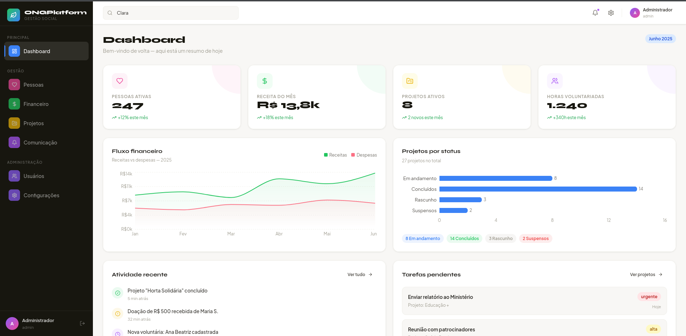
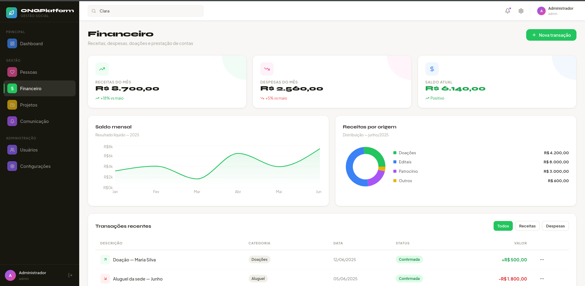

<div align="center">


<br/><br/>


<br/><br/>

# 🌱 ONG Platform

### Plataforma Open Source de Gestão de ONGs

*Pessoas · Financeiro · Projetos · Comunicação — em uma única plataforma gratuita*

</div>

---

## 📸 Screenshots

<div align="center">

### Dashboard


### Módulo Financeiro


</div>

---

## ✨ Sobre o projeto

**ONG Platform** é uma plataforma completa e gratuita para gestão de organizações sem fins lucrativos. Desenvolvida como software livre, ela centraliza pessoas, finanças, projetos e comunicação em uma interface moderna e intuitiva.

### Por que essa plataforma existe?

Muitas ONGs no Brasil ainda usam planilhas desconexas, papéis físicos ou sistemas pagos inacessíveis para gerir suas operações. Este projeto nasce para mudar isso — oferecendo uma ferramenta profissional, gratuita e que pode ser hospedada pela própria organização.

---

## 🎨 Módulos

| Módulo | Cor | Funcionalidades |
|---|---|---|
| 📊 **Dashboard** | Azul | Indicadores, gráficos de fluxo financeiro, atividade recente |
| 🩷 **Pessoas** | Rosa | Membros, voluntários, beneficiários, doadores, horas voluntariadas |
| 💚 **Financeiro** | Verde | Receitas, despesas, doações, relatórios, gráficos por origem |
| 💛 **Projetos** | Amarelo | Projetos, tarefas, indicadores de impacto, orçamentos |
| 💜 **Comunicação** | Lilás | Notificações, templates de e-mail, logs de envio |
| 🟣 **Usuários** | Roxo | Controle de acesso com 4 papéis via RBAC |

---

## 🛠️ Stack tecnológica

```
Frontend          Backend           Banco de dados      Infra
─────────         ───────           ──────────────      ─────
React 18          Node.js 20        PostgreSQL 16       Docker Compose
Vite 5            Fastify 4         SQLite (dev)        Nginx
Recharts          Prisma ORM        Migrations          GitHub Actions
Lucide Icons      JWT + RBAC        Seed automático     .env por ambiente
```

---

## 🚀 Como rodar localmente

### Pré-requisito
- [Node.js 20+](https://nodejs.org)
- [Docker + Docker Compose](https://docs.docker.com/compose/) *(opcional)*

### Opção 1 — Docker (recomendado)

```bash
git clone https://github.com/SEU_USUARIO/ong-platform.git
cd ong-platform
cp .env.example .env
docker compose up -d
docker compose exec api npm run db:migrate
docker compose exec api npm run db:seed
```

Acesse **http://localhost:5173**

### Opção 2 — Só o frontend

```bash
cd apps/frontend
npm install
npm run dev
```

> 🔑 **Login de teste:** `admin@suaong.org` / `admin123456`

---

## 📁 Estrutura do projeto

```
ong-platform/
├── apps/
│   ├── frontend/                  # React + Vite
│   │   └── src/
│   │       ├── components/layout/ # Sidebar, Topbar
│   │       ├── pages/             # auth · dashboard · pessoas · financeiro · projetos · comunicacao · usuarios
│   │       └── styles/            # Design system (tokens + global)
│   └── api/                       # Node.js + Fastify
│       └── src/
│           ├── modules/           # auth · pessoas · financeiro · projetos · comunicacao
│           ├── shared/            # middlewares · utils
│           └── config/            # Prisma client · seed
├── packages/db/prisma/
│   └── schema.prisma              # 18 modelos · Postgres + SQLite
├── docker-compose.yml
└── .env.example
```

---

## 🔑 Controle de acesso (RBAC)

| Papel | Pode fazer |
|---|---|
| `ADMIN` | Tudo, incluindo gerenciar usuários e configurações |
| `COORDENADOR` | Criar e editar projetos, pessoas e transações |
| `VOLUNTARIO` | Registrar horas, visualizar projetos |
| `VISUALIZADOR` | Somente leitura em todos os módulos |

---

## 🌐 Deploy em produção

| Plataforma | Tipo | Custo |
|---|---|---|
| [Railway](https://railway.app) | PaaS | Gratuito (tier) |
| [Render](https://render.com) | PaaS | Gratuito (tier) |
| [Fly.io](https://fly.io) | Containers | Gratuito (tier) |
| VPS + Nginx | Self-hosted | ~R$ 20/mês |

---

## 🤝 Contribuindo

1. Fork o repositório
2. Crie uma branch: `git checkout -b feature/minha-feature`
3. Commit: `git commit -m 'feat: adiciona funcionalidade X'`
4. Push: `git push origin feature/minha-feature`
5. Abra um Pull Request

### Roadmap

- [ ] Integração com PIX para recebimento de doações
- [ ] Relatórios exportáveis em PDF
- [ ] App mobile (React Native)
- [ ] Modo escuro
- [ ] Importação de dados via planilha

---

## 📄 Licença

MIT — use, modifique e distribua livremente.

---

<div align="center">

Feito com 💚 para as ONGs do Brasil

⭐ Se este projeto te ajudou, deixe uma estrela no repositório!

</div>
